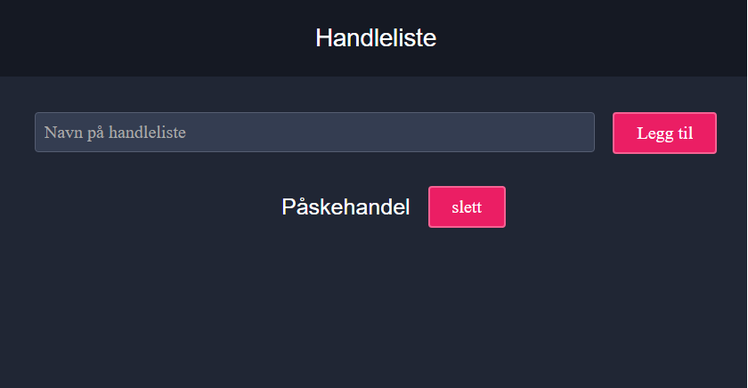
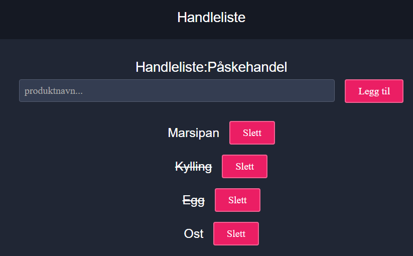

# Shopping-list

## Case-beskrivelse

Du skal lage en enkel applikasjon for å opprette handlelister. Det skal være mulig å legge inn flere handlelister, og hver av disse skal kunne inneholde en liste med oppføringer over ting som skal handles.

### Opprettelse og listing av handlelister


På denne siden skal det være mulig å:
1. Legge til ny handeliste ved å legge til navn og trykke på "Legg til"
2. Trykke på navnet til handleliste for å gå til side som viser innhold.
3. Trykke på slett-knappen for å fjerne handelisten.

### Vise detaljer for en handleliste

På denne siden skal brukeren kunne:
1. Legge til nye elementer ved å skrive inn produktnavn og trykke på "Legg til"
2. Trykke på teksten for å markere elementet som ferdig (strek gjennom tekst)
3. Tykke på slett for å fjerne element fra listen

## Oppstart

Kjør følgende kommandoer i prosjektmappen:

```
npm i
npm start
```

## Oppgave 1
Konfigurer routeren til å vise innholdet i komponenten ShippingLists på root "/".

Hint: Både App- og ShippingList-komponentene skal vises. Se nærmerere på IndexRoute for å få til dette.

## Oppgave 2
Utvid ShippingLists-komponenten med funksjonalitet for å vise en liste med handlelister som vist i skjermbildet ovenfor.

Som testdata kan du utvide shippingListsReducer med default state:
```
const testData = [
    {
        id: 1,
        name: 'Handleliste 1',
        items: [
            {
                id: 1,
                name: 'Gulost',
                complete: false
            }
        ]
    },
    {
        id: 2,
        name: 'Handleliste 2',
        items: [
            {
                id: 2,
                name: 'Kylllig',
                complete: false
            },
            {
                id: 3,
                name: 'Egg',
                complete: false
            }
        ]
    }
];
```

## Oppgave 3
I denne oppgaven skal du utvide handelisten med mulighet for å legge til nye handelister. Det skal være et input felt hvor brukeren skal skrive inn navn og en knapp for å legge den til i listen (se skjermbilde)

Forslag til actions:
- ADD_SHOPPING_LIST : Trykke på knappen for å legge til handleliste
- NEW_SHOPPING_LIST_NAME_CHANGED : Endring av navn på handeliste

Fjern navnet på handelisten fra input-boksen når den legges til. Kan gjøres ved å sette navn til '' ved trigging av ADD_SHOPPING_LIST.

## Oppgave 4
Legg til en knapp for å slette en handleliste.

Forslag til actions:
- REMOVE_SHOPPING_LIST : Trigges ved trykk på sletteknappen. Må ha med id på handeliste som argument.

Hint: Bruk Array.filter() for å filtere bort handlelisten som slettes.

## Oppgave 5
1. Legg til route for å vise detaljert informasjon på /shoppinglist/:id. Den nye routen skal bruke en ny komponent du oppretter selv.
2. Legg til link på navnene i handelisten slik at klikk på dem tar brukeren til den aktuelle handlelisten.

Linker lages ved å bruke <Link /> fra react-router.

Hent riktig handeliste ved å bruke id-parameter fra url gjennom bruk av router.params.id i mapStateToProps.

## Oppgave 6
Lag funksjonalitet for å legge til elemeter på handelisten.

Forslag til oppdatering av element på handeliste.
```
const clonedState = JSON.parse(JSON.stringify(state));
const itemToUpdate = clonedState.find(item => item.id === action.payload.id);
itemToUpdate.items.push({id: nextItemId++, name: action.payload.newItemName, complete: false});

return clonedState;
```

## Oppgave 7
Gjør det mulig å slette elemeter fra handelisten

## Oppgave 8
Legg til funksjonalitet for å trykk på elementene i handelisten for å markere dem som ferdig. 
